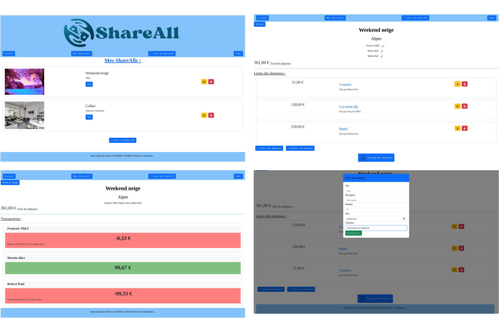

# ShareAll

## Introduction

Au cours du module Web Oriented Architecture (WOA) réalisé en 3ème année de la spécialité Développement informatique et exploitation Opérationnelle (DO) à Polytech Montpellier, j'ai eu à développer une application web sur le principe de l'application mobile Tricount.

Mon application web nommée ShareAll permet donc de gérer et d'équilibrer les dépenses effectuées à plusieurs à l'occasion d'un voyage entre amis par exemple.

Vous aurez ainsi accès à différentes fonctionnalités :

-  Créer des ShareAll (groupe)
-  Ajouter des participants
-  Ajouter des dépenses
-  Suivre l'état des comptes
-  Équilibrer et connaitre combien vous devez à chaque participants





## Pré-requis

Afin de pouvoir exécuter l'application sur votre poste, vous devez d'abord installer les dépendances suivantes :

-  Node.js : Vous pouvez le télécharger et l'installer à partir de https://nodejs.org/. Version : v18.13.0

-  npm (Node Package Manager) : Il est automatiquement installé avec Node.js. npm est utilisé pour installer les dépendances nécessaires pour l'application.

-  Postgresql : Vous pouvez l'installer à partir de https://www.postgresql.org/download/

## Procédure d'installation

- Pour installer l’application sur son PC, on commence par télécharger son code source avec git .
```bash
git clone git@github.com:isalyne34/projetWOA.git
```
-  Commencer par installer toutes les dépendances grâce à la commande :

```bash
npm install
```

-  Dans postgresql, récupérer le [script](
creation_bd.txt) et l'importer afin de créer les tables. Créer une nouvelle BDD et un utilisateur qui possède des droits dessus.

``` bash
psql

postgres=# create user nomUtilisateur;
CREATE ROLE

postgres=# create database "nomProjet";
CREATE DATABASE

postgres=# grant all privileges on database nomProjet to nomUtilisateur;
GRANT

postgres=# alter role nomUtilisateur with password 'password';
ALTER ROLE

psql -U nomUtilisateur -h localhost -d nomProjet
```

Puis modifier le fichier [postgres-config.js](https://github.com/isalyne34/projetWOA/blob/main/backend/postgres-config.js) présent dans le dossier backend pour qu'il corresponde à vos données .

```js
const Pool = require('pg').Pool;
const pool = new Pool({
   user: 'nomUtilisateur',
   host: 'URLbasedonnées',
   database: 'nomProjet',
   password: 'password',
   port: 5432,
}).connect();

module.exports = pool;
```

## Execution

-  Ouvrir un terminal à la racine du projet .

-  Lancer le backend :

   ```bash
   cd backend
   node server.js
   ```

-  Lancer le frontend :

   ```bash
   cd frontend
   npm run dev
   ```

-  Ouvrir un navigateur à l'adresse [http://localhost:5173](http://localhost:5173)

## Guide d'utilisation

> [!WARNING]
> Rafraichir la page afin d'afficher les modifications 

- Si la base de données est vide, vous pouvez :
    -  Créer un voyage 
    -  Créer un utilisateur et l'ajouter au voyage
    -  Cliquer sur le voyage, et créer des dépenses en associant la dépense à la personne qui l'a créée 

> [!WARNING]
> Il faut créer l'utilisateur avant de pouvoir l'associer

- Si la base de données existe déjà, vous pouvez :
    - Modifier un voyage grâce au bouton crayon situé à droite
    - Supprimer un voyage
    - Rajouter un  membre ou une dépense 
    - Modifier une dépense
    - Modifier un utilisateur 
    - Voir le partage des dépenses 

## Fabriqué avec

**Front** : react avec les librairies : bootstrap et formik

**Back** : node, express

**Base de données** postgresql


## Structure du projet

```
├── frontend
│  ├── public
│  |   ├── assets <-- images
│  ├── src
│  │   ├── config <-- configurations
│  │   ├── components <-- composants de l'application (tout ceux qui ne sont pas des pages)
│  │   ├── layout <-- Définition du header et footer
│  │   ├── pages <-- Tout composants qui sont utilisés par le routeur
│  │   ├── index.css <-- Style du site
│  └── └── main.tsx <-- Différentes routes du site
├── backend
|   ├── postgres-config.js
│   ├── queries.js <-- Définition des différentes requêtes
│   └── server.js <-- routes

```


## Modifications futures

- [ ]  Ajout de photos pour partager les tickets de caisse

- [ ]  Notifications

- [ ]  Fonctionnement hors-ligne

- [ ]  Répartition inégale
